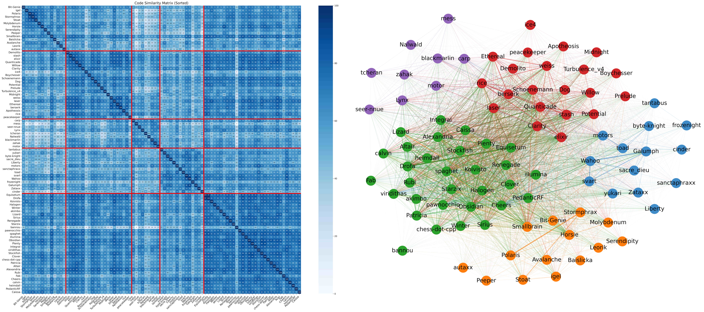

## Setup and run

```bash
conda create -n engine_similarity python=3.12
conda activate engine_similarity
pip install torch --index-url https://download.pytorch.org/whl/cu126
pip install accelerate seaborn numpy scikit-learn matplotlib sentence_transformers opencv-python einops
./run.sh
```

## Fancy graph


